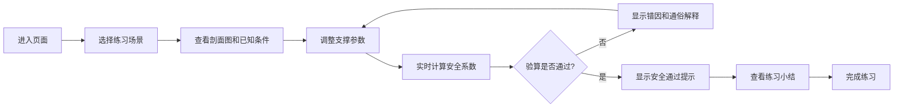

## 1. 产品概述

模板支撑安全教学练习平台，面向建筑工程专业学生和新入职施工员，通过轻量互动方式帮助用户理解模板支撑体系的验算逻辑。

- 主要用途：课堂教学演示、岗前培训、方案编制前基础复习
- 解决问题：将枯燥的力学验算转化为可视化互动练习，降低学习门槛
- 目标用户：建筑工程专业学生、新入职施工员、现场技术管理人员
- 市场价值：填补建筑安全教学互动工具的空白，提升学习效率和记忆效果

## 2. 核心功能

### 2.1 用户角色
| 角色 | 注册方式 | 核心权限 |
|------|----------|----------|
| 学习者 | 无需注册 | 浏览场景、调整参数、查看计算结果和解释 |

### 2.2 功能模块
1. **场景选择区**：地下室顶板、高支模梁、普通楼板等练习场景选择
2. **参数试算区**：立杆间距、步距、板厚、木方间距、施工荷载等参数调整，实时显示安全系数
3. **错因讲解区**：验算不通过时，解释具体失效原因（立杆稳定不足、面板挠度过大、扣件抗滑不满足等），并用通俗文字说明参数影响机制
4. **练习小结**：列出本次调整过程和正确布置思路

### 2.3 页面详情
| 页面名称 | 模块名称 | 功能描述 |
|-----------|-------------|---------------------|
| 主页面 | 场景选择模块 | 卡片式场景列表，点击切换场景，显示简化剖面图和已知条件 |
| 主页面 | 参数试算模块 | 滑块+输入框双重调整方式，参数变化时实时计算安全系数，颜色提示危险等级 |
| 主页面 | 错因讲解模块 | 分条列出不满足项，每项包含专业术语和通俗解释，配合示意图 |
| 主页面 | 练习小结模块 | 可展开面板，记录调整历史，给出正确布置建议 |

## 3. 核心流程

用户进入页面 → 选择练习场景 → 查看剖面图和已知条件 → 调整立杆间距/步距/板厚等参数 → 实时查看安全系数变化和颜色提示 → 如验算不通过，查看具体失效原因和通俗解释 → 继续调整参数直至通过 → 查看练习小结，记录本次学习过程

## 4. 用户界面设计

### 4.1 设计风格
- 主色调：工程蓝（#1E40AF）+ 安全黄（#F59E0B）+ 警示红（#DC2626）+ 成功绿（#059669）
- 配色逻辑：蓝色代表专业、黄色代表警告、红色代表危险、绿色代表安全
- 按钮风格：圆角矩形，带有微妙阴影和悬停缩放效果
- 字体：标题使用思源黑体 Bold，正文使用思源黑体 Regular，数字使用等宽字体增强可读性
- 布局风格：三栏式卡片布局，左侧场景选择，中间参数试算和剖面图，右侧错因讲解
- 图标风格：使用 Lucide 线性图标，配合工程相关符号

### 4.2 页面设计概述
| 页面名称 | 模块名称 | UI 元素 |
|-----------|-------------|-------------|
| 主页面 | 场景选择模块 | 卡片网格、场景图标、难度标签、选中高亮动画 |
| 主页面 | 剖面图模块 | SVG 简化剖面图、参数标注、危险区域闪烁动画 |
| 主页面 | 参数试算模块 | 自定义滑块（带刻度）、数字输入框、安全系数仪表盘、颜色渐变指示器 |
| 主页面 | 错因讲解模块 | 折叠面板、图标+文字说明、通俗解释气泡、原因分类标签 |
| 主页面 | 练习小结模块 | 时间线调整记录、建议清单、打印/导出按钮 |

### 4.3 响应式
- 桌面端：三栏并排布局，充分利用屏幕空间
- 平板端：上下堆叠布局，场景选择改为顶部标签切换
- 移动端：单列流式布局，剖面图自适应缩放，参数区域可滚动
- 触摸优化：滑块增加触摸热区，按钮最小尺寸 44px

### 4.4 动效设计
- 页面加载：分区块渐入动画，延迟错落显示
- 场景切换：剖面图平滑过渡，参数区域滑入滑出
- 安全系数变化：数字滚动动画，仪表盘指针平滑移动
- 危险提示：红色区域脉冲闪烁，错因卡片弹性出现
- 参数调整：滑块跟随反馈，剖面图实时标注更新
