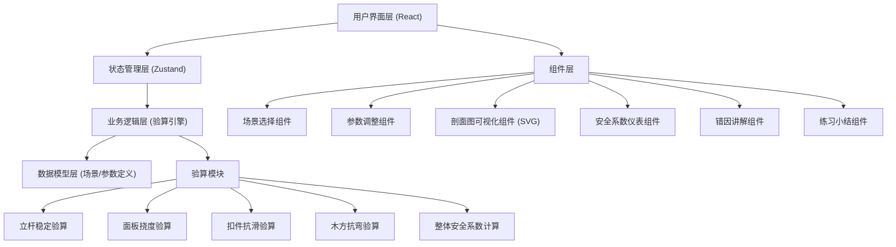
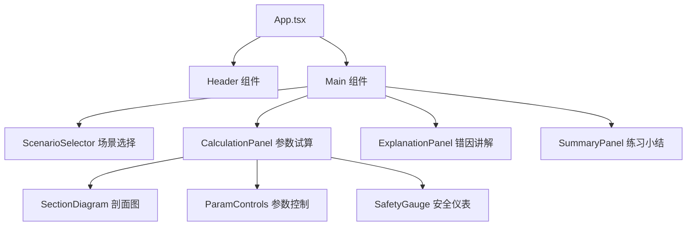

## 1. 架构设计



## 2. 技术描述
- **前端框架**: React 18 + TypeScript 5
- **构建工具**: Vite 5
- **样式方案**: Tailwind CSS 3.4
- **状态管理**: Zustand 4.5
- **图标库**: Lucide React 0.344
- **动画方案**: CSS Transitions + Framer Motion（可选，用于复杂动画）
- **无后端，纯前端**：所有计算逻辑在客户端完成，数据存储在 LocalStorage（用于保存练习记录）

## 3. 路由定义
| 路由 | 用途 |
|-------|---------|
| / | 主练习页面，包含所有功能模块 |

## 4. 数据模型

### 4.1 场景数据模型
```typescript
interface Scenario {
  id: string;
  name: string;
  description: string;
  difficulty: 'easy' | 'medium' | 'hard';
  icon: string;
  knownConditions: {
    concreteGrade: string;      // 混凝土等级
    steelGrade: string;         // 钢筋等级
    templateThickness: number;  // 模板厚度 (mm)
    woodType: string;           // 木方材质
    tubeType: string;           // 钢管规格
  };
  defaultParams: CalculationParams;
  paramRanges: ParamRanges;
  sectionDiagram: SVGDiagramConfig;
  correctSolution: string;
}

interface CalculationParams {
  poleSpacingX: number;      // 立杆纵距 (mm)
  poleSpacingY: number;      // 立杆横距 (mm)
  stepDistance: number;      // 步距 (mm)
  slabThickness: number;     // 板厚 (mm)
  woodSpacing: number;       // 木方间距 (mm)
  constructionLoad: number;  // 施工荷载 (kN/m²)
}

interface ParamRanges {
  poleSpacingX: [number, number, number];   // [min, max, step]
  poleSpacingY: [number, number, number];
  stepDistance: [number, number, number];
  slabThickness: [number, number, number];
  woodSpacing: [number, number, number];
  constructionLoad: [number, number, number];
}

interface SVGDiagramConfig {
  width: number;
  height: number;
  elements: DiagramElement[];
}

type DiagramElement = 
  | { type: 'rect'; x: number; y: number; width: number; height: number; fill: string; label?: string }
  | { type: 'line'; x1: number; y1: number; x2: number; y2: number; stroke: string; strokeWidth: number }
  | { type: 'text'; x: number; y: number; text: string; fontSize?: number }
  | { type: 'dimension'; x1: number; y1: number; x2: number; y2: number; label: string };
```

### 4.2 验算结果模型
```typescript
interface CalculationResult {
  overallSafetyFactor: number;
  status: 'safe' | 'warning' | 'danger';
  checks: CheckItem[];
  timestamp: number;
}

interface CheckItem {
  id: string;
  name: string;
  description: string;
  safetyFactor: number;
  requiredFactor: number;
  passed: boolean;
  failureReason?: string;
  plainExplanation: string;
  affectedParams: string[];
}

interface AdjustmentRecord {
  params: CalculationParams;
  result: CalculationResult;
  timestamp: number;
}
```

### 4.3 预设场景数据
```typescript
const SCENARIOS: Scenario[] = [
  {
    id: 'basement-slab',
    name: '地下室顶板',
    description: '典型地下室顶板模板支撑，厚度大、荷载重',
    difficulty: 'medium',
    icon: 'building-2',
    knownConditions: {
      concreteGrade: 'C35',
      steelGrade: 'HRB400',
      templateThickness: 15,
      woodType: '松木 50×100',
      tubeType: 'φ48×3.0'
    },
    defaultParams: {
      poleSpacingX: 900,
      poleSpacingY: 900,
      stepDistance: 1500,
      slabThickness: 300,
      woodSpacing: 250,
      constructionLoad: 2.5
    },
    paramRanges: {
      poleSpacingX: [600, 1200, 50],
      poleSpacingY: [600, 1200, 50],
      stepDistance: [1200, 1800, 100],
      slabThickness: [200, 500, 10],
      woodSpacing: [150, 400, 10],
      constructionLoad: [1.0, 5.0, 0.5]
    },
    sectionDiagram: { /* SVG 配置 */ },
    correctSolution: '立杆纵距900mm×横距900mm，步距1500mm，木方间距250mm'
  },
  {
    id: 'high-formwork-beam',
    name: '高支模梁',
    description: '高度超过8m的高支模体系，需重点验算立杆稳定',
    difficulty: 'hard',
    icon: 'ruler',
    knownConditions: {
      concreteGrade: 'C40',
      steelGrade: 'HRB400',
      templateThickness: 18,
      woodType: '松木 100×100',
      tubeType: 'φ48×3.5'
    },
    defaultParams: {
      poleSpacingX: 600,
      poleSpacingY: 600,
      stepDistance: 1200,
      slabThickness: 1200,
      woodSpacing: 200,
      constructionLoad: 3.0
    },
    paramRanges: {
      poleSpacingX: [400, 900, 50],
      poleSpacingY: [400, 900, 50],
      stepDistance: [900, 1500, 100],
      slabThickness: [600, 1500, 50],
      woodSpacing: [150, 300, 10],
      constructionLoad: [2.0, 5.0, 0.5]
    },
    sectionDiagram: { /* SVG 配置 */ },
    correctSolution: '立杆纵距600mm×横距600mm，步距1200mm，设置剪刀撑'
  },
  {
    id: 'normal-slab',
    name: '普通楼板',
    description: '标准层普通楼板，厚度适中，适合初学者练习',
    difficulty: 'easy',
    icon: 'layers',
    knownConditions: {
      concreteGrade: 'C30',
      steelGrade: 'HRB400',
      templateThickness: 12,
      woodType: '松木 50×80',
      tubeType: 'φ48×3.0'
    },
    defaultParams: {
      poleSpacingX: 1000,
      poleSpacingY: 1000,
      stepDistance: 1800,
      slabThickness: 120,
      woodSpacing: 300,
      constructionLoad: 2.0
    },
    paramRanges: {
      poleSpacingX: [800, 1500, 50],
      poleSpacingY: [800, 1500, 50],
      stepDistance: [1500, 2000, 100],
      slabThickness: [100, 200, 10],
      woodSpacing: [200, 400, 10],
      constructionLoad: [1.0, 3.0, 0.5]
    },
    sectionDiagram: { /* SVG 配置 */ },
    correctSolution: '立杆纵距1000mm×横距1000mm，步距1800mm，木方间距300mm'
  }
];
```

### 4.4 验算逻辑（简化教学模型）
```typescript
// 立杆稳定验算
function checkPoleStability(params: CalculationParams): CheckItem {
  // 简化公式：N = (混凝土自重 + 施工荷载) × 受力面积
  const concreteWeight = params.slabThickness / 1000 * 25; // kN/m²
  const loadArea = (params.poleSpacingX / 1000) * (params.poleSpacingY / 1000); // m²
  const N = (concreteWeight + params.constructionLoad) * loadArea;
  
  // 立杆容许承载力（简化，根据步距调整）
  const allowableN = 35 - (params.stepDistance - 1500) / 100 * 5; // kN
  
  const safetyFactor = allowableN / N;
  
  return {
    id: 'pole-stability',
    name: '立杆稳定性',
    description: '验算立杆在轴向压力作用下是否会发生失稳破坏',
    safetyFactor,
    requiredFactor: 1.3,
    passed: safetyFactor >= 1.3,
    plainExplanation: safetyFactor >= 1.3 
      ? '立杆间距合理，步距适中，立杆不会被压弯。'
      : '立杆间距太大或步距太高，就像竹竿太长容易弯，立杆可能失稳倒塌。',
    affectedParams: ['poleSpacingX', 'poleSpacingY', 'stepDistance', 'slabThickness', 'constructionLoad']
  };
}

// 面板挠度验算
function checkSlabDeflection(params: CalculationParams): CheckItem {
  // 简化公式：挠度与木方间距的4次方成正比，与板厚的3次方成反比
  const deflectionIndex = Math.pow(params.woodSpacing / 250, 4) / Math.pow(params.slabThickness / 120, 3);
  const safetyFactor = 1 / deflectionIndex;
  
  return {
    id: 'slab-deflection',
    name: '面板挠度',
    description: '验算模板面板在荷载作用下的弯曲变形是否超过容许值',
    safetyFactor,
    requiredFactor: 1.0,
    passed: safetyFactor >= 1.0,
    plainExplanation: safetyFactor >= 1.0
      ? '木方间距合适，模板不会下垂变形。'
      : '木方间距太大，模板就像架在稀板凳上的木板，中间会向下弯，造成楼板底面不平整。',
    affectedParams: ['woodSpacing', 'slabThickness']
  };
}

// 扣件抗滑验算
function checkCouplerSlip(params: CalculationParams): CheckItem {
  // 简化公式：考虑水平杆节点处的抗滑承载力
  const concreteWeight = params.slabThickness / 1000 * 25;
  const loadPerPole = (concreteWeight + params.constructionLoad) * 
                      (params.poleSpacingX / 1000) * (params.poleSpacingY / 1000);
  const allowableSlip = 8; // kN，直角扣件抗滑承载力
  const safetyFactor = allowableSlip / (loadPerPole / 4); // 每根立杆分担4个扣件
  
  return {
    id: 'coupler-slip',
    name: '扣件抗滑',
    description: '验算钢管扣件连接处是否会发生滑移',
    safetyFactor,
    requiredFactor: 1.25,
    passed: safetyFactor >= 1.25,
    plainExplanation: safetyFactor >= 1.25
      ? '荷载在扣件抗滑能力范围内，连接可靠。'
      : '荷载太大时，扣件就像没拧紧的衣服扣子，受力太大可能滑脱，造成支撑体系垮塌。',
    affectedParams: ['poleSpacingX', 'poleSpacingY', 'slabThickness', 'constructionLoad']
  };
}

// 木方抗弯验算
function checkWoodBending(params: CalculationParams): CheckItem {
  // 简化公式：木方弯矩与木方间距成正比，与跨度平方成正比
  const loadPerLength = (params.slabThickness / 1000 * 25 + params.constructionLoad) * params.woodSpacing / 1000;
  const moment = loadPerLength * Math.pow(params.poleSpacingY / 1000, 2) / 8;
  const allowableMoment = 1.2; // kN·m，简化值
  const safetyFactor = allowableMoment / moment;
  
  return {
    id: 'wood-bending',
    name: '木方抗弯',
    description: '验算木方在荷载作用下的抗弯强度是否满足',
    safetyFactor,
    requiredFactor: 1.3,
    passed: safetyFactor >= 1.3,
    plainExplanation: safetyFactor >= 1.3
      ? '木方间距和跨度合理，木方不会断裂。'
      : '木方间距太大或跨度太长，木方就像架在两个支点间的扁担，太重会断。',
    affectedParams: ['woodSpacing', 'poleSpacingY', 'slabThickness', 'constructionLoad']
  };
}
```

## 5. 组件划分



### 核心组件清单
| 组件名 | 功能 | 位置 |
|--------|------|------|
| `ScenarioSelector.tsx` | 场景卡片列表，点击切换 | `src/components/ScenarioSelector.tsx` |
| `SectionDiagram.tsx` | SVG 剖面图渲染，参数标注 | `src/components/SectionDiagram.tsx` |
| `ParamControls.tsx` | 滑块+输入框参数调整 | `src/components/ParamControls.tsx` |
| `ParamSlider.tsx` | 单个参数滑块组件 | `src/components/ParamSlider.tsx` |
| `SafetyGauge.tsx` | 安全系数仪表盘 | `src/components/SafetyGauge.tsx` |
| `CheckItemCard.tsx` | 单项验算结果卡片 | `src/components/CheckItemCard.tsx` |
| `ExplanationPanel.tsx` | 错因讲解面板 | `src/components/ExplanationPanel.tsx` |
| `SummaryPanel.tsx` | 练习小结面板 | `src/components/SummaryPanel.tsx` |
| `AdjustmentTimeline.tsx` | 调整历史时间线 | `src/components/AdjustmentTimeline.tsx` |

### 状态管理 Store
```typescript
// src/store/usePracticeStore.ts
interface PracticeState {
  currentScenarioId: string | null;
  currentParams: CalculationParams | null;
  currentResult: CalculationResult | null;
  adjustmentHistory: AdjustmentRecord[];
  setScenario: (id: string) => void;
  updateParam: (key: keyof CalculationParams, value: number) => void;
  resetToDefault: () => void;
  clearHistory: () => void;
}
```

### 工具函数
| 文件名 | 功能 |
|--------|------|
| `src/utils/calculationEngine.ts` | 验算核心逻辑，各分项验算函数 |
| `src/utils/scenarioData.ts` | 场景预设数据 |
| `src/utils/formatters.ts` | 数值格式化、单位转换 |
| `src/utils/colorUtils.ts` | 安全等级颜色映射 |
